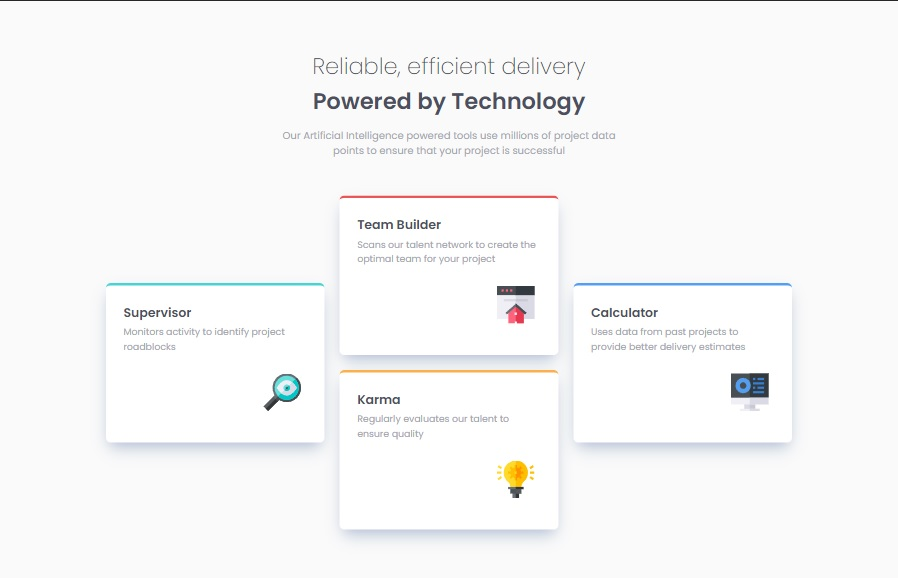
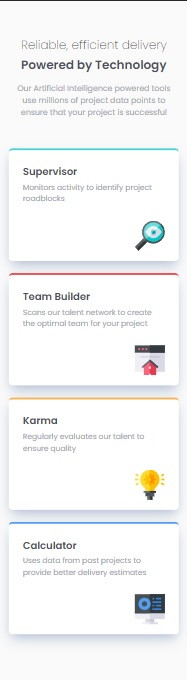

# Frontend Mentor - Four card feature section solution

This is a solution to the [Four card feature section challenge on Frontend Mentor](https://www.frontendmentor.io/challenges/four-card-feature-section-weK1eFYK). Frontend Mentor challenges help you improve your coding skills by building realistic projects.

## Table of contents

- [Overview](#overview)
  - [The challenge](#the-challenge)
  - [Screenshot](#screenshot)
  - [Links](#links)
- [My process](#my-process)
  - [Built with](#built-with)
  - [What I learned](#what-i-learned)
  - [Continued development](#continued-development)
  - [Useful resources](#useful-resources)
- [Author](#author)
- [Acknowledgments](#acknowledgments)

## Overview

### The challenge

Users should be able to:

- View the optimal layout for the site depending on their device's screen size

### Screenshot




### Links

- Solution URL: [Add solution URL here](https://your-solution-url.com)
- Live Site URL: [Add live site URL here](https://your-live-site-url.com)

## My process

### Built with

- Semantic HTML5 markup
- CSS custom properties
- Flexbox
- CSS Grid
- Mobile-first workflow

### What I learned

I learned about grid areas, naming them and setting them up to fit this challenge.

```css
.cards {
  display: grid;
  gap: 1.5rem;
  grid-template-columns: repeat(3, 1fr);
  grid-template-rows: repeat(2, 1fr);
  grid-template-areas:
    "start mid-up end"
    "start mid-down end";
}

.card:first-child {
  grid-area: start;
  align-self: center;
}

.card:nth-child(2) {
  grid-area: mid-up;
}

.card:nth-child(3) {
  grid-area: mid-down;
}

.card:nth-child(4) {
  grid-area: end;
  align-self: center;
}
```

### Continued development

I'd like to explore grid layout more, I've noticed I tend to use flex more by default, so I feel like I need to expand my grid skills.

### Useful resources

- [W3schools grid-area](https://www.w3schools.com/cssref/pr_grid-area.asp) - This helped me with the card arangement.
- [Grid area video](https://www.youtube.com/watch?v=duH4DLq5yoo)

## Author

- Frontend Mentor - [@zp021](https://www.frontendmentor.io/profile/zp021)
- GitHub - [@zp021](https://github.com/zp021)
